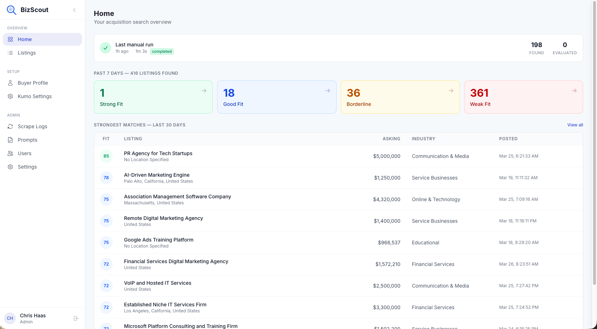
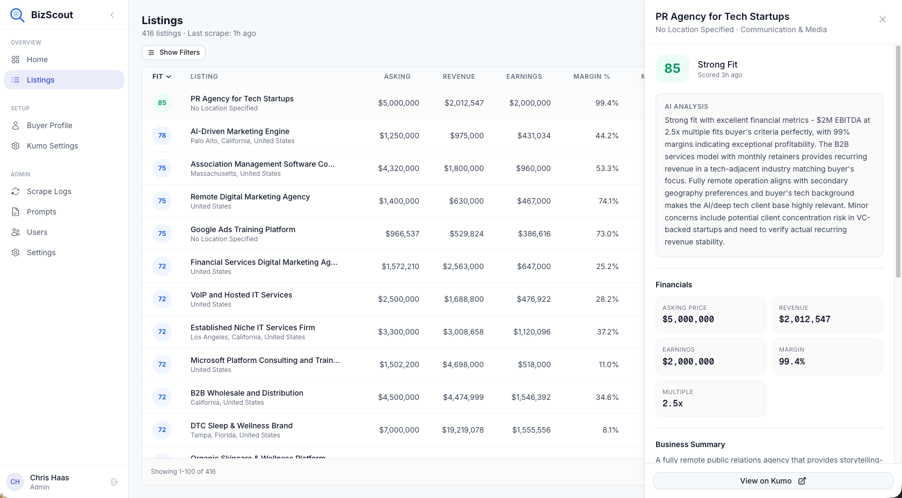
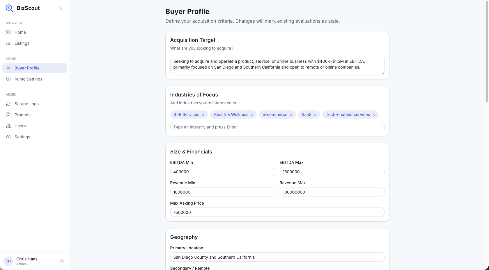
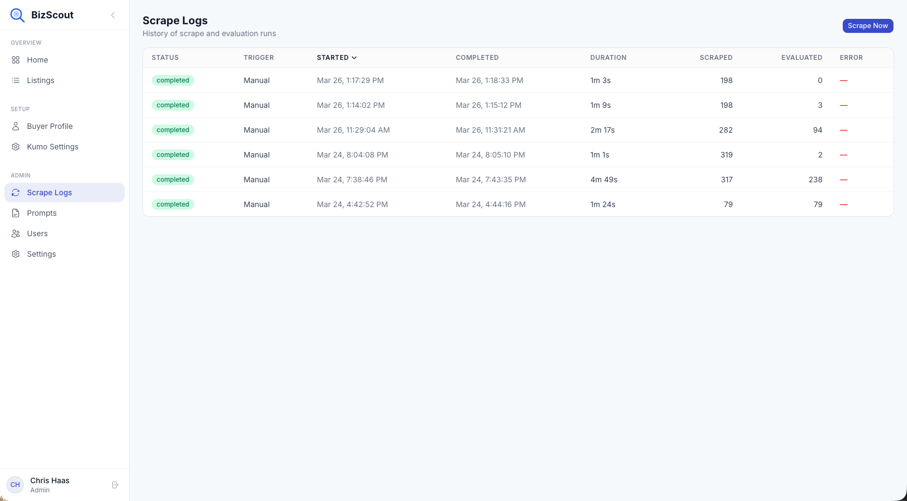

# BizScout

AI-powered business-for-sale sourcing and evaluation platform. BizScout scrapes listings from Kumo, scores them against your buyer profile using Claude, and surfaces the strongest acquisition matches.

## Screenshots

### Dashboard

Overview with last scrape status, fit score distribution, and strongest matches at a glance.



### Listings

Full listings table with sortable columns, filters, and a slide-out detail panel showing AI analysis and financials.



### Buyer Profile

Define your acquisition criteria — target description, industries, financials, geography, and deal structure. Changes automatically mark existing evaluations as stale.



### Scrape Logs

History of all scrape and evaluation runs with real-time streaming logs when you trigger a manual scrape.



## Tech Stack

- **Framework**: Next.js 16 (App Router)
- **Database & Auth**: Supabase (Postgres + Row Level Security)
- **AI Evaluation**: Anthropic Claude API
- **Data Source**: Kumo API
- **UI**: Tailwind CSS + shadcn/ui
- **Deployment**: Vercel

## Setup

### Prerequisites

- Node.js 20+
- A [Supabase](https://supabase.com) project
- An [Anthropic API key](https://console.anthropic.com)
- A [Kumo](https://app.withkumo.com) account

### 1. Clone and install

```bash
git clone https://github.com/cmhaas19/biz-scout.git
cd biz-scout
npm install
```

### 2. Supabase database

In your Supabase project's SQL Editor, run these files in order:

1. `supabase/schema.sql`
2. `supabase/fix_rls.sql`
3. `supabase/eval_counts_function.sql`

### 3. Environment variables

Copy `.env.local.example` or create `.env.local`:

```
NEXT_PUBLIC_SUPABASE_URL=https://your-project.supabase.co
NEXT_PUBLIC_SUPABASE_ANON_KEY=your-anon-key
SUPABASE_SERVICE_ROLE_KEY=your-service-role-key
ANTHROPIC_API_KEY=sk-ant-...
CRON_SECRET=any-random-secret-string
NEXT_PUBLIC_APP_URL=http://localhost:3000
```

Find Supabase keys in **Project Settings > API**.

### 4. Supabase auth

In Supabase **Authentication > URL Configuration**:

- **Site URL**: `http://localhost:3000` (or your deployed URL)
- **Redirect URLs**: add `http://localhost:3000/callback`

### 5. Run

```bash
npm run dev
```

### 6. First use

1. Sign up at `/signup`
2. Complete your **Buyer Profile** under Setup
3. Connect your **Kumo** account under Setup > Kumo Settings
4. Go to **Admin > Scrape Logs** and click **Scrape Now**

## Deploy to Vercel

1. Push to GitHub and import the repo at [vercel.com/new](https://vercel.com/new)
2. Add the environment variables listed above (set `NEXT_PUBLIC_APP_URL` to your Vercel URL)
3. Deploy
4. Update Supabase auth **Site URL** and **Redirect URLs** to match your Vercel domain
5. The daily cron job is configured in `vercel.json` (requires Vercel Pro)

## Project Structure

```
src/
  app/
    (app)/           # Authenticated routes (sidebar layout)
      admin/         # Admin: scrape logs, prompts, users, settings
      listings/      # Listings table
      setup/         # Buyer profile, Kumo connection
    (auth)/          # Login, signup, OAuth callback
    api/             # API routes
  components/
    dashboard/       # Dashboard client
    layout/          # Sidebar, nav
    listings/        # Listings table, detail panel
    scrape/          # Scrape modal with streaming logs
    profile/         # Buyer profile editor
    ui/              # shadcn components
  lib/
    kumo.ts          # Kumo scraping
    evaluator.ts     # Claude AI evaluation
    format.ts        # Formatting utilities
    settings.ts      # System settings with cache
    supabase/        # Supabase client helpers
  types/             # TypeScript interfaces
```
